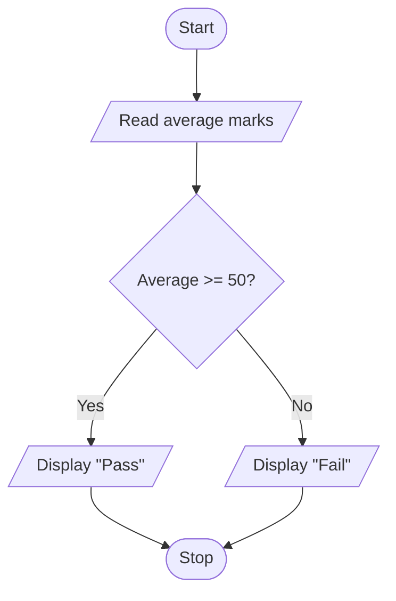

```mermaid
flowchart TB
    Start([Start])
    Input[/Read average marks/]
    Check{Average >= 50?}
    Pass[/Display "Pass"/]
    Fail[/Display "Fail"/]
    Stop([Stop])

    Start --> Input
    Input --> Check
    Check -- Yes --> Pass
    Check -- No --> Fail
    Pass --> Stop
    Fail --> Stop
```    