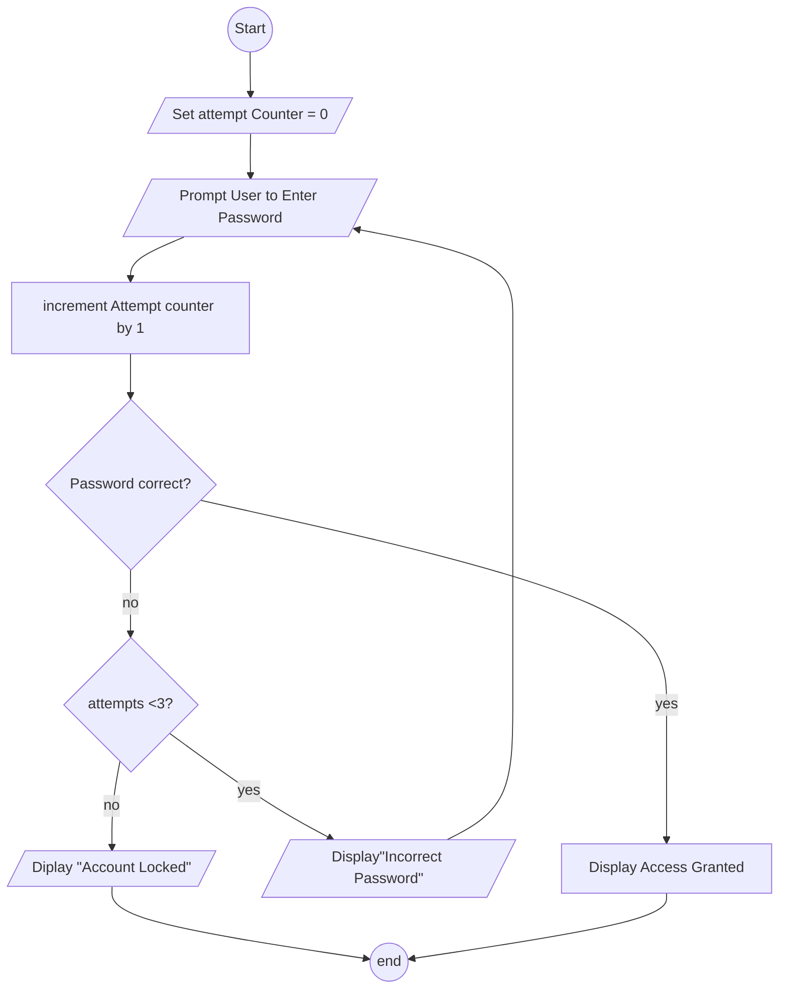

```mermaid
graph TD
    
    Start((Start))-->Counter0[/Set attempt Counter = 0/]
    Counter0-->Password[/Prompt User to Enter Password/]
    Password-->attempt2[increment Attempt counter by 1]
    attempt2-->check{Password correct?}
    check--yes-->AccessGranted[Display Access Granted]
    check--no -->check2{attempts <3?}
    check2--yes-->wrong[/Display"Incorrect Password"/]
    check2--no -->lock[/Diplay "Account Locked"/]
    wrong-->Password
    lock-->End((end))
    AccessGranted-->End
```