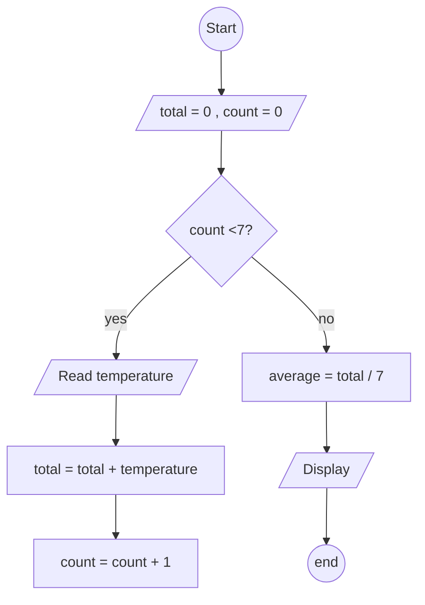

```mermaid

graph TD
start((Start))-->total[/total = 0 , count = 0/]
total-->check{count <7?}
check--yes-->read[/Read temperature/]
check--no -->average[average = total / 7]
read-->total2[total = total + temperature]
total2-->count[count = count + 1]
average-->display[/Display/]
display-->End((end))


```