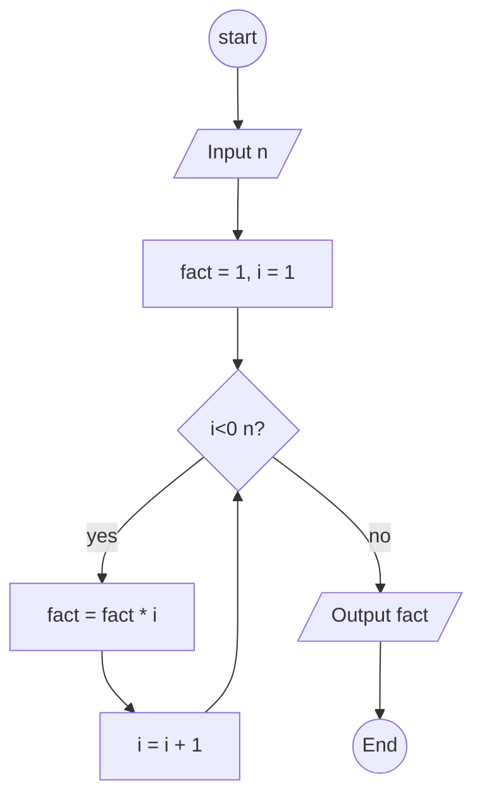

```mermaid
graph TD

Start((start))-->Input[/Input n/]
Input-->fact[fact = 1, i = 1]
fact-->check{i<0 n?}
check--yes-->fact2[fact = fact * i] 
check--no -->Output[/Output fact/]
fact2-->int[i = i + 1]
int-->check
Output-->End((End))
```