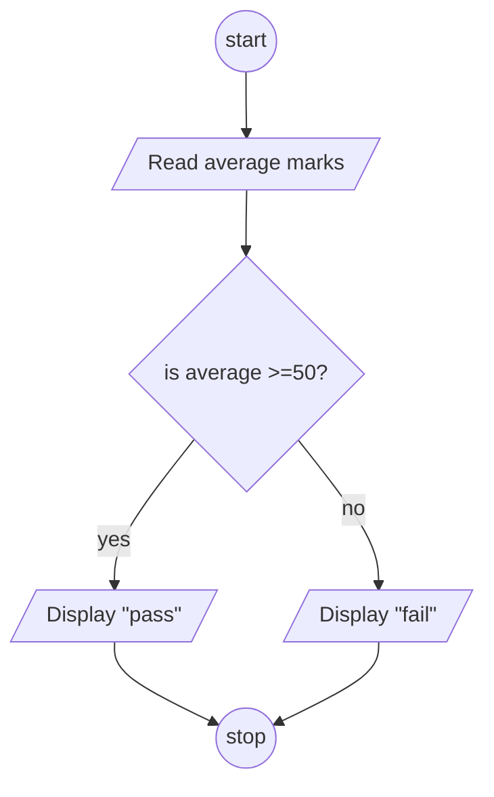

```mermaid
flowchart TB

    Start((start))-->Input[/Read average marks/]
    Input-->check{is average >=50?}
    check--yes-->pass[/Display "pass"/]
    check--no -->fail[/Display "fail"/]
    pass-->stop((stop))
    fail-->stop
```    