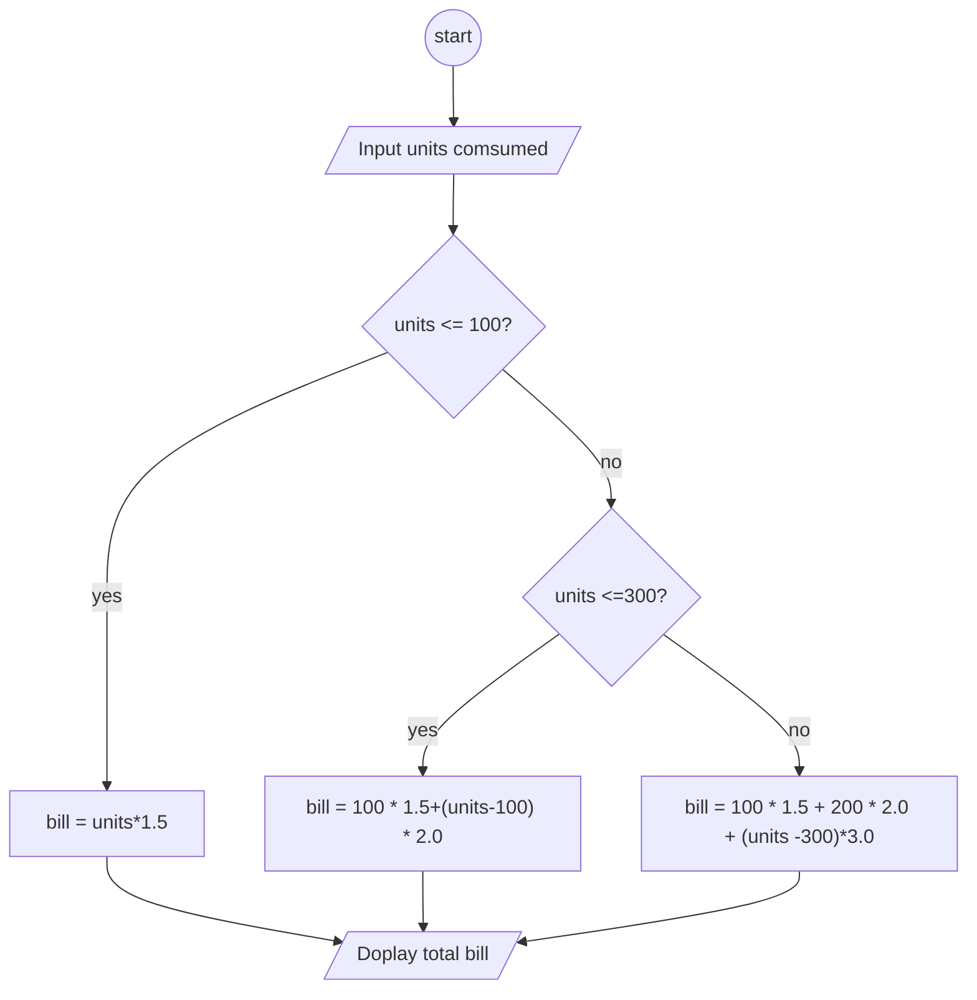

```mermaid


graph TD

start((start))-->input[/Input units comsumed/]
input-->check{units <= 100?}
check--yes-->bill[bill = units*1.5]
check--no -->check2{units <=300?}
check2--yes-->bill2["bill = 100 * 1.5+(units-100) * 2.0"]
check2--no -->bill3["bill = 100 * 1.5 + 200 * 2.0 + (units -300)*3.0"]
bill-->Display[/Doplay total bill/]
bill2-->Display
bill3-->Display

```