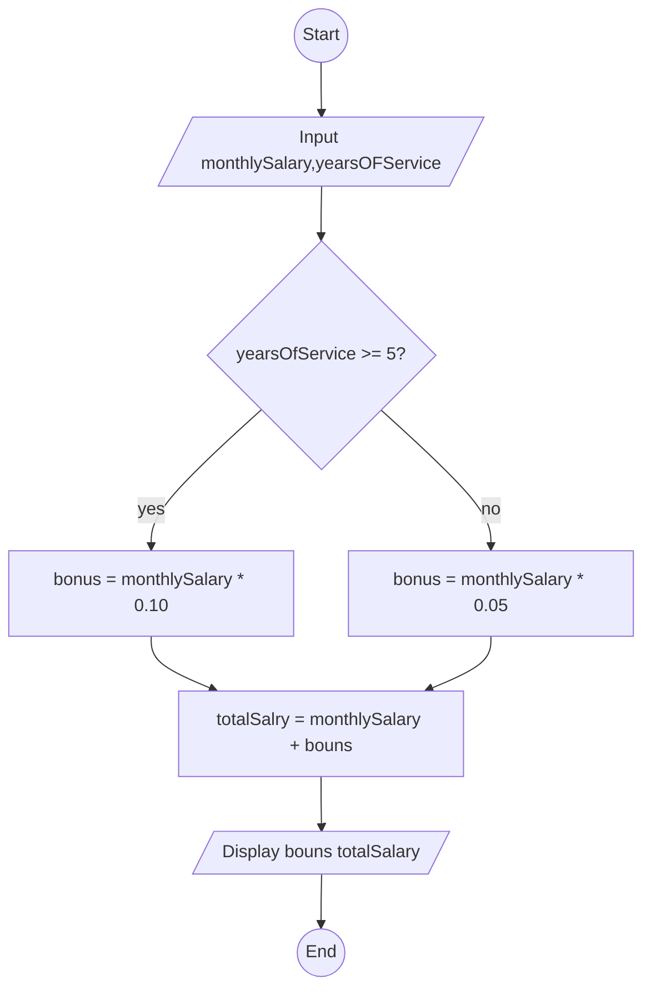

```mermaid
graph TD
Start((Start))-->Input[/Input monthlySalary,yearsOFService/]
Input-->check{yearsOfService >= 5?}
check--yes-->Bonus[bonus = monthlySalary * 0.10]
check--no -->bonus2[bonus = monthlySalary * 0.05]
Bonus-->total[totalSalry = monthlySalary + bouns]
bonus2-->total
total-->Display[/Display bouns totalSalary/]
Display-->End((End))
```