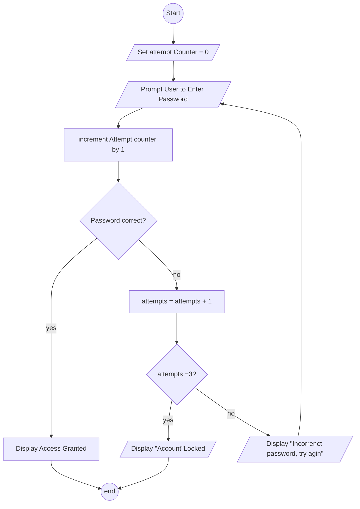

```mermaid
graph TD

    Start((Start))-->Counter0[/Set attempt Counter = 0/]
    Counter0-->Password[/Prompt User to Enter Password/]
    Password-->attempt2[increment Attempt counter by 1]
    attempt2-->check{Password correct?}
    check--yes-->AccessGranted[Display Access Granted]
    AccessGranted-->End((end))
    check--no -->Attempts[attempts = attempts + 1]
    Attempts-->check2{attempts =3?}
    check2--yes-->lock[/Display "Account"Locked/]
    lock-->End
    check2--no -->Try[/Display "Incorrenct password, try agin"/]
    Try-->Password

```