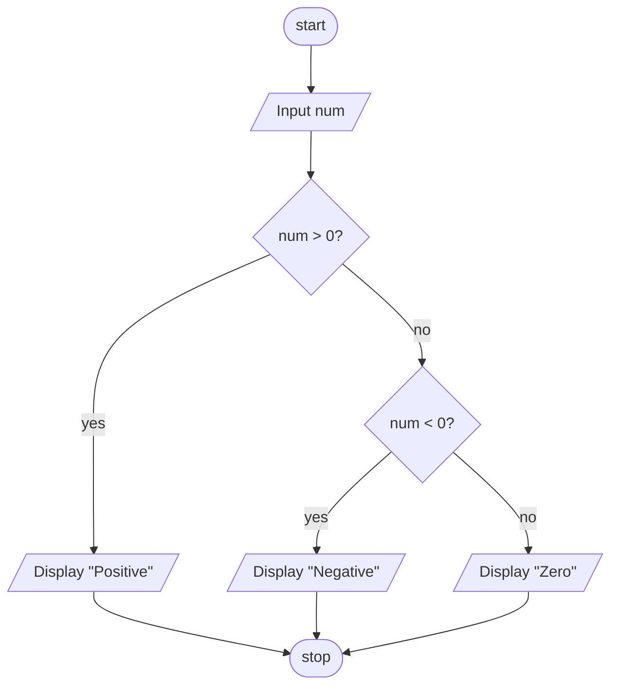

```mermaid

graph TD

Start([start])-->Input[/Input num/]
Input-->check{num > 0?}
check--yes-->Display[/Display "Positive"/]
check--no -->check2{num < 0?}
check2--yes-->Display2[/Display "Negative"/]
check2--no -->Display3[/Display "Zero"/]
Display-->stop([stop])
Display2-->stop
Display3-->stop

```