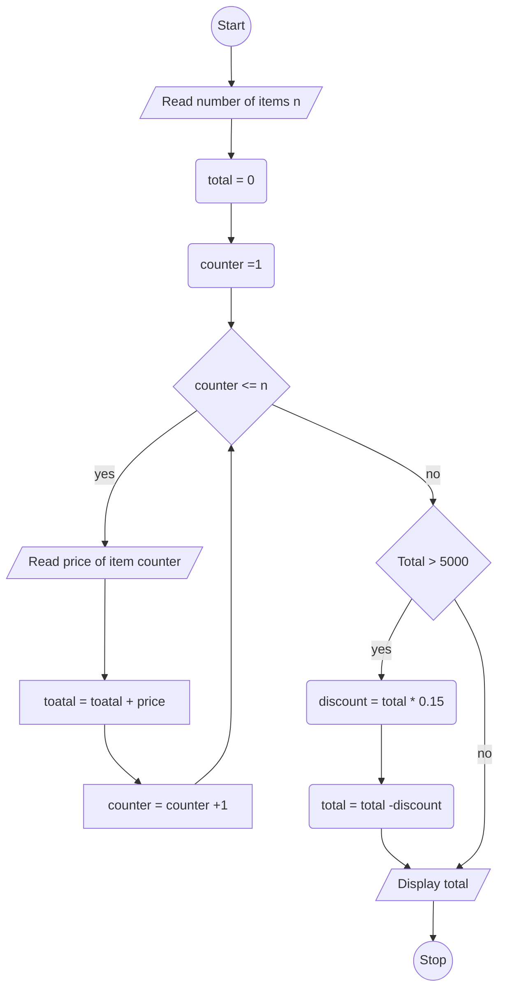

```mermaid

graph TD
Start((Start))-->number[/Read number of items n/]
number-->total(total = 0)
total-->counter(counter =1)
counter-->check{counter <= n}
check--yes-->price[/Read price of item counter/]
check--no -->check2{Total > 5000}
price-->total2[toatal = toatal + price]
total2-->counter2[counter = counter +1]
counter2-->check
check2--yes-->dicount(discount = total * 0.15)
dicount-->total3(total = total -discount)
total3-->Display[/Display total/]
check2--no -->Display
Display-->Stop((Stop))
```