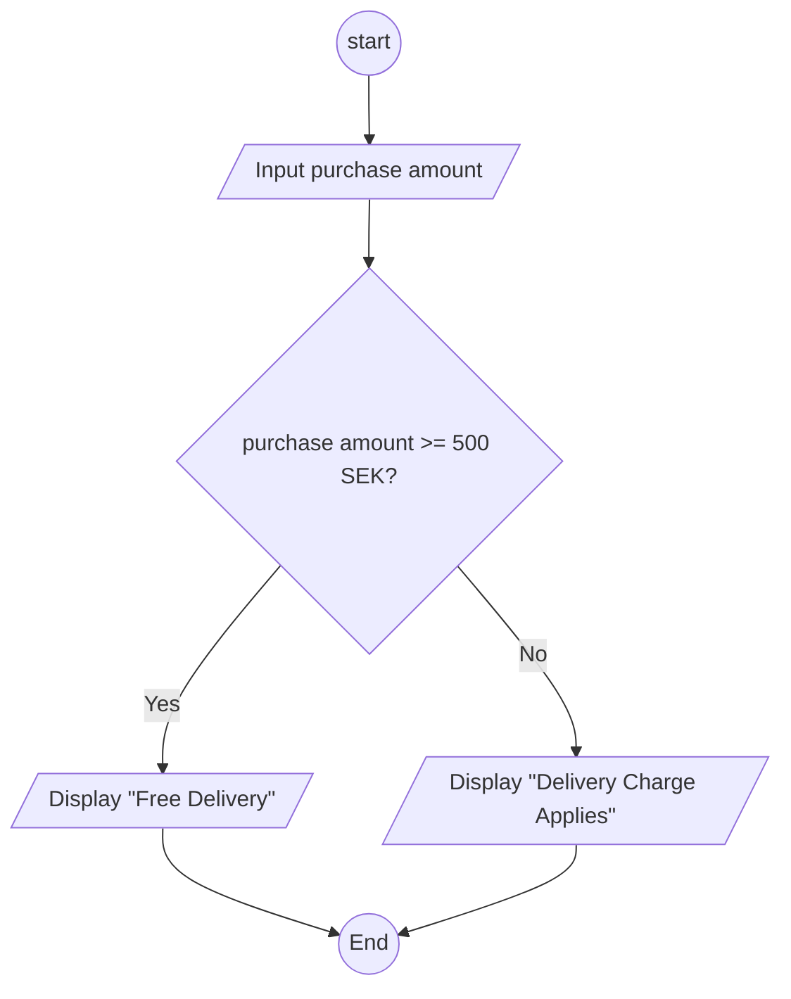

```mermaid

graph TD
    Start((start))-->Input[/Input purchase amount/]
    Input-->Check{purchase amount &gt;= 500 SEK?}
    Check--Yes-->Free[/Display "Free Delivery"/]
    Check--No -->Charge[/Display "Delivery Charge Applies"/]
    Free-->End((End))
    Charge-->End
```    